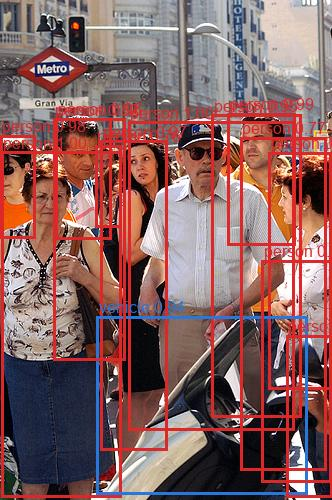
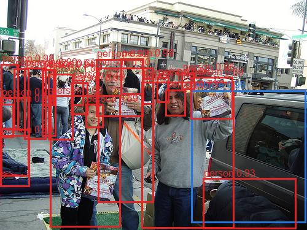
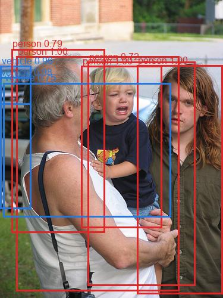
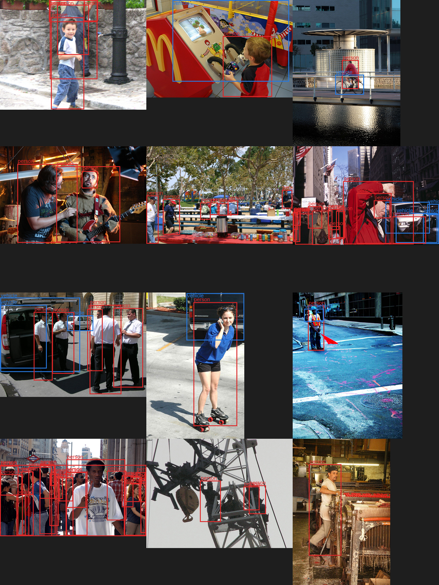
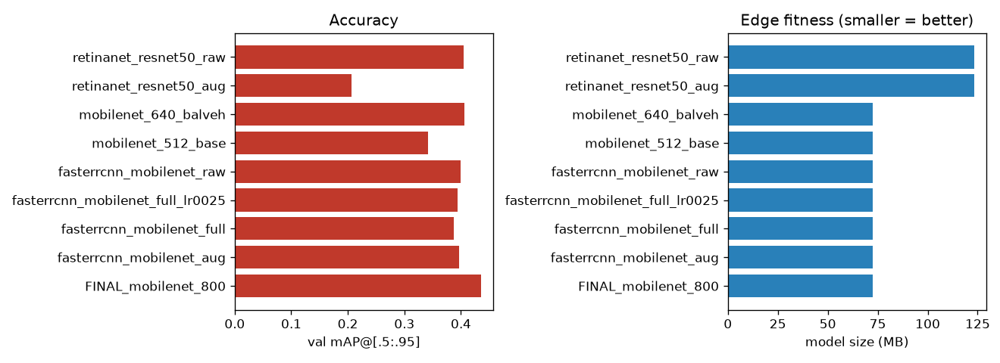
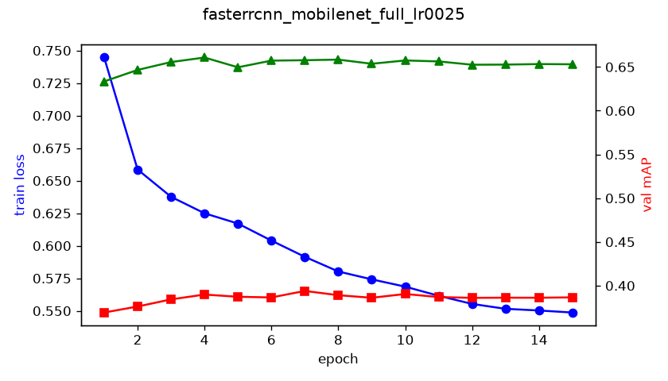

<h1 align="center">Built without a single human label</h1>
<p align="center"><b>A person / vehicle detector that runs live — on your phone, in the browser.</b></p>

<p align="center">
  <a href="https://elaybarlev.github.io/CompVision/web/"></a>
  
  
  
</p>

<p align="center">
  
  
  
</p>

> **Intro to Computer Vision · Final Project 2026 · Elay Barlev**
> Semi-supervised dataset creation + a small, edge-deployable object detector — **no human annotations anywhere in the pipeline.**

---

## 📲 Try it now

The trained model runs **entirely in your phone's browser** (onnxruntime-web, WASM) — no app, no server, nothing leaves the device.

<table>
<tr>
<td width="60%">

**→ [elaybarlev.github.io/CompVision/web/](https://elaybarlev.github.io/CompVision/web/)**

- Point the camera at a **person** or a **vehicle** — boxes are drawn on-device.
- A **model picker** switches the same detector between **512 / 640 / 800 px** so you can feel the **accuracy ↔ speed** trade-off live.
- ~72 MB model, a few FPS on a Pixel-class CPU.

</td>
<td width="40%" align="center">

</td>
</tr>
</table>

---

## How it works — zero human labels

```
Flickr images          Florence-2 <OD>        + COCO Faster R-CNN        small detector          ONNX
(no labels)    ─────▶   (VLM annotator)  ─────▶  (ensemble vote on   ─────▶  MobileNet      ─────▶  on-device
                                                  every box → vehicles)        Faster R-CNN            WASM (phone)
```

A large vision-language model (**Florence-2**) auto-annotates the Flickr dataset for *person* and *vehicle*. A second, COCO-trained detector **votes on every box** (Weighted Boxes Fusion) to confirm labels and recover the sparse vehicle class. A compact **MobileNetV3 Faster R-CNN** then learns from those machine-made labels and is exported to ONNX for the phone.

<p align="center"></p>

---

## Results

Trained **both** Faster R-CNN (MobileNet) and RetinaNet (ResNet50), then picked the edge winner on **accuracy + size + CPU latency**:

<p align="center"></p>

| model | mAP@.5 | size | CPU latency | verdict |
|---|---|---|---|---|
| **Faster R-CNN — MobileNetV3-FPN** | **≈ 0.70** | **72 MB** | **~65 ms** | ✅ edge winner |
| RetinaNet — ResNet50-FPN | 0.67 | 123 MB | ~466 ms | too heavy for the edge |

**The deployed model, at the three resolutions in the live picker** (full 690-image val set):

| input size | accuracy · mAP@[.5:.95] | precision · mAP@.5 | size |
|---|---|---|---|
| 512 px *(edge fast)* | 0.368 | 0.630 | 72 MB |
| 640 px *(balanced)* | 0.426 | 0.697 | 72 MB |
| **800 px *(max accuracy)*** | **0.437** | **0.700** | 72 MB |

<details>
<summary><b>Key insights from training</b></summary>



- **Raw vs. augmented** was within noise for Faster R-CNN — reported straight, not cherry-picked.
- The mAP **plateau is the noisy auto-label ceiling**, not the model — better labels, not more epochs, is the real lever.
- **Inference resolution**, not extra training, is the biggest free lever: 512→640 px buys **+0.058 mAP / +0.045 vehicle AP** on the *same* weights.
- Caught a **data-leakage** bug (independent splits → 85 % of val seen in training) and an **AMP footgun** (Faster R-CNN is ~15× slower under mixed precision — now auto-guarded).
</details>

---

## Repository map

| Stage | Code | Write-up |
|---|---|---|
| 1 · Create the dataset (auto-annotate) | [`src/dataset/`](src/dataset/) | [`docs/01`](docs/), [`02`](docs/02_florence2_vs_sam3.md), [`04`](docs/04_degrees_of_freedom.md), [`07`](docs/07_annotation_method.md) |
| 2 · Train the detector(s) | [`src/train/`](src/train/) | [`docs/03_model_choice.md`](docs/03_model_choice.md) |
| 3 · Inference (single image + folder) | [`src/infer/`](src/infer/) | — |
| Bonus · TTA + ensemble cleanup | [`src/tta_ensemble/`](src/tta_ensemble/) | [`docs/05_tta_and_ensemble.md`](docs/05_tta_and_ensemble.md) |
| Bonus · Phone / ONNX deploy | [`src/edge/`](src/edge/), [`web/`](web/) | [`docs/08_edge_phone_deploy.md`](docs/08_edge_phone_deploy.md) |
| Slides + video script | [`slides/`](slides/) | — |
| Every decision, dated | — | [`docs/decisions_log.md`](docs/decisions_log.md) |

---

## Quickstart

```bash
# 1. env + CUDA PyTorch (the default PyPI wheel is CPU-only)
python -m venv .venv && source .venv/Scripts/activate        # Windows Git Bash
pip install torch torchvision --index-url https://download.pytorch.org/whl/cu126
pip install -r requirements.txt

# 2. dataset (Florence-2 auto-annotation → COCO train/val split)
python src/dataset/download.py
python src/dataset/annotate.py --task od
python src/dataset/build_dataset.py --out-dir data/processed/ensemble

# 3. train (raw, then augmented — the comparison the brief asks for)
python src/train/train_fasterrcnn.py --epochs 20
python src/train/train_fasterrcnn.py --epochs 20 --augment

# 4. inference deliverables
python src/infer/infer_image.py  --weights weights/<tag>_best.pt --image some.jpg
python src/infer/infer_folder.py --weights weights/<tag>_best.pt --folder some_dir

# 5. (bonus) export for the phone and serve locally
python src/edge/export_onnx.py --weights weights/<tag>_best.pt   # -> web/model.onnx
python -m http.server -d web 8000
```

Full step-by-step (incl. `eval.py` re-scoring and the phone deploy) is in **[`docs/06_runbook.md`](docs/06_runbook.md)**.
Hardware: trained locally on an **NVIDIA RTX 3080 Laptop (8 GB)** — small batches, AMP guarded per-arch.

---

## Deliverables

✅ trained weights · ✅ training code · ✅ dataset-creation code · ✅ single-image + folder inference · ✅ degrees-of-freedom / TTA / ensemble write-ups ([`docs/`](docs/)) · ✅ raw-vs-augmented comparison · ✅ [slides](slides/final_presentation.pdf) (PDF + PPTX) · ✅ bonus on-device phone demo.
